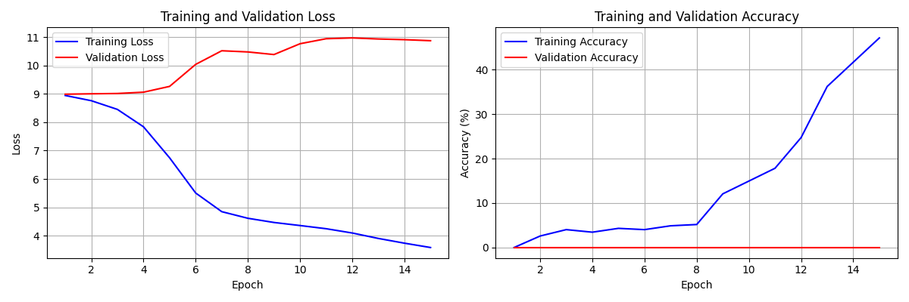
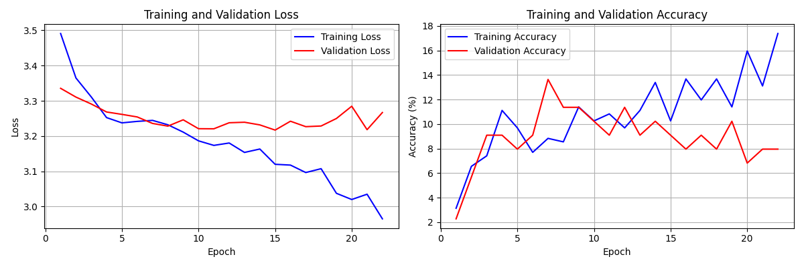

# SightTrack AI

A deep learning system for automated species classification using computer vision. This project implements a state-of-the-art EfficientNet-based neural network to classify wildlife species from photographs, targeting taxonomic family-level identification.

## Overview

SightTrack AI processes biodiversity observation data from sources like iNaturalist and GBIF to train image classification models that can identify species families from photographs. The system uses modern deep learning techniques including data augmentation, transfer learning, and hierarchical classification to achieve robust performance across diverse taxonomic groups.

### Key Features

- **Multi-level Classification**: Supports classification at different taxonomic levels (species, genus, family, etc.)
- **Advanced Data Augmentation**: Implements MixUp, CutMix, and other augmentation techniques
- **Transfer Learning**: Built on pre-trained EfficientNet models for better performance
- **Hierarchical Labels**: Maintains full taxonomic hierarchy for comprehensive classification
- **GPU/CPU Support**: Automatically detects and utilizes available hardware
- **Comprehensive Evaluation**: Includes detailed metrics and visualization tools

## Current Model Performance

The trained model classifies 28 taxonomic families with the following architecture:
- **Backbone**: EfficientNet-V2-S
- **Input Size**: 224x224 RGB images
- **Classes**: 28 taxonomic families
- **Training Data**: 441 observations across diverse species

### Training Results


*Training and validation metrics for initial model run*


*Improved training results with enhanced configuration*

## Project Structure

```
sighttrack-ai/
├── train_species_model.py     # Main training script
├── predict_species.py         # Inference and prediction
├── process_observations.py    # Data processing and preparation
├── model.py                   # Core model architecture
├── requirements.txt           # Python dependencies
├── config.json                # Training configuration
├── filtered_family_data.csv   # Processed training dataset
├── family_label_encoder.json  # Label encoding mappings
├── images/                    # Training images directory
├── graphs/                    # Training visualization plots
└── best_model.pth            # Trained model weights
```

## Installation

### Prerequisites

- Python 3.8+
- CUDA-compatible GPU (optional, for faster training)

### Setup

1. Clone the repository:
```bash
git clone <repository-url>
cd sighttrack-ai
```

2. Install dependencies:
```bash
pip install -r requirements.txt
```

3. Verify installation:
```bash
python quick_start.py
```

## Usage

### Quick Start

For immediate model training with default settings:

```bash
python quick_start.py
```

This script guides you through the complete process including data verification, GPU detection, and training initiation.

### Training a New Model

1. **Prepare your dataset**:
```bash
python process_observations.py
```

2. **Configure training parameters** in `config.json`:
```json
{
  "csv_file": "filtered_family_data.csv",
  "image_dir": "images",
  "batch_size": 4,
  "num_epochs": 100,
  "backbone": "efficientnet_v2_s",
  "learning_rate": 0.00005,
  "target_level": "family"
}
```

3. **Start training**:
```bash
python train_species_model.py
```

### Making Predictions

Classify a single image:
```bash
python predict_species.py --image path/to/image.jpg --model best_model.pth
```

Batch processing:
```bash
python predict_species.py --batch path/to/images/ --model best_model.pth
```

### Data Processing

Process raw biodiversity data:
```bash
python process_observations.py --input your_data.zip --output processed_data.csv
```

## Model Architecture

The system uses EfficientNet-V2 as the backbone architecture with the following enhancements:

- **Feature Extraction**: Pre-trained EfficientNet-V2-S with frozen early layers
- **Classification Head**: Fully connected layers with dropout for regularization
- **Data Augmentation**: Random crops, rotations, color jittering, MixUp, and CutMix
- **Training Strategy**: Cosine annealing learning rate schedule with early stopping
- **Loss Function**: Cross-entropy with label smoothing

### Supported Taxonomic Families

The current model recognizes 28 taxonomic families including:
- **Birds**: Corvidae (crows), Paridae (tits), Anatidae (ducks), Ardeidae (herons)
- **Mammals**: Cervidae (deer)
- **Insects**: Nymphalidae (butterflies), Apidae (bees)
- **Plants**: Pinaceae (pines), Amaryllidaceae (amaryllis family)
- **Marine Life**: Asteriidae (starfish)

## Configuration

Key configuration parameters in `config.json`:

- `batch_size`: Training batch size (default: 4)
- `learning_rate`: Initial learning rate (default: 0.00005)
- `backbone`: Model architecture (efficientnet_v2_s, efficientnet_v2_m, resnet50)
- `dropout`: Dropout probability (default: 0.5)
- `num_epochs`: Maximum training epochs (default: 100)
- `early_stopping_patience`: Early stopping patience (default: 15)
- `use_mixup`: Enable MixUp augmentation (default: true)
- `use_cutmix`: Enable CutMix augmentation (default: true)

## Data Requirements

### Input Format

The system expects CSV data with the following columns:
- `id`: Unique observation identifier
- `scientificName`: Full scientific name
- `kingdom`, `phylum`, `class`, `order`, `family`, `genus`: Taxonomic hierarchy
- `decimalLatitude`, `decimalLongitude`: Geographic coordinates
- `image_filename`: Corresponding image file name
- `eventDate`: Observation timestamp

### Image Requirements

- **Format**: JPEG/JPG
- **Resolution**: Minimum 224x224 pixels (higher resolution recommended)
- **Quality**: Clear, well-lit photos with visible subject features
- **Naming**: Must match `image_filename` column in CSV data

## Performance Optimization

### Hardware Recommendations

- **GPU**: NVIDIA GPU with 8GB+ VRAM for optimal training speed
- **RAM**: 16GB+ system memory for large datasets
- **Storage**: SSD recommended for faster data loading

### Training Tips

1. **Batch Size**: Adjust based on GPU memory (reduce if encountering CUDA OOM errors)
2. **Learning Rate**: Start with 0.00005 and adjust based on validation performance
3. **Data Augmentation**: Enable MixUp/CutMix for better generalization
4. **Early Stopping**: Monitor validation accuracy to prevent overfitting

## Monitoring and Evaluation

The training process provides comprehensive monitoring:

- **TensorBoard Integration**: Real-time training visualization
- **Validation Metrics**: Accuracy, loss, and per-class performance
- **Model Checkpointing**: Automatic saving of best-performing models
- **Training Curves**: Loss and accuracy plots saved to `graphs/` directory

## Troubleshooting

### Common Issues

1. **CUDA Out of Memory**: Reduce `batch_size` in configuration
2. **Missing Images**: Verify `image_dir` path and file naming consistency
3. **Poor Performance**: Increase training data or adjust augmentation parameters
4. **Convergence Issues**: Modify learning rate or enable cosine annealing schedule

### Debug Tools

- `debug_validation.py`: Validate data integrity and model inputs
- `analyze_training.py`: Analyze training performance and suggest improvements
- `diagnose_data.py`: Identify data quality issues

## Contributing

1. Fork the repository
2. Create a feature branch
3. Make your changes
4. Add tests for new functionality
5. Submit a pull request

## License

This project is licensed under the MIT License. See LICENSE file for details.

## Citation

If you use this work in your research, please cite:

```
SightTrack AI: Automated Species Classification Using Deep Learning
[Your Name/Institution]
[Year]
```

## Acknowledgments

- Built using PyTorch and Torchvision
- EfficientNet architecture from Google Research
- Training data sourced from iNaturalist and GBIF
- Inspired by modern computer vision research in biodiversity monitoring 